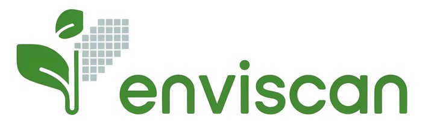
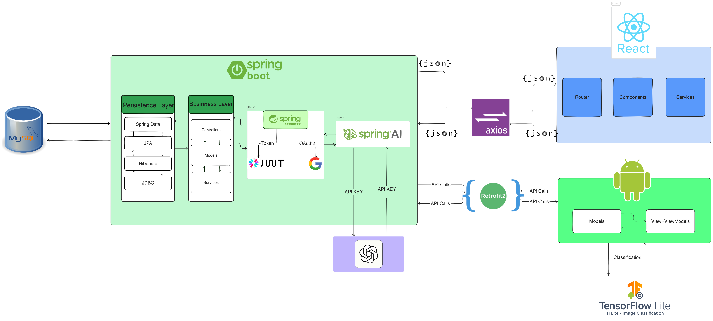

# EnviScan: Plant Identification and Management Application 🌱


This platform enables real-time plant identification and management using advanced machine learning techniques. EnviScan helps users identify plants through photo capture, provides detailed care information, and manages maintenance schedules through an intuitive mobile interface.

## Table of Contents

- [Software Architecture](#software-architecture)
- [Docker Image](#docker-image)
- [Features](#features)
- [Technical Stack](#technical-stack)
- [Backend Project Structure](#backend-project-structure)
- [Getting Started](#getting-started)
- [Contributing](#contributing)
- [Contact](#contact)
- [Screenshots](#screenshots)

## Software Architecture 🏗️


The application architecture uses React.js for the web admin interface, Android native app for mobile client, Spring Boot for the backend, and OpenAI integration for the chatbot service, with communication via RESTful APIs.

## Docker Configuration 🐳

The project uses Docker to containerize both backend and frontend services. Below are the detailed configurations for each part:

### Backend Docker Configuration

The backend setup includes MySQL, phpMyAdmin, and the Spring Boot application containers.

```yaml
services:
  mysqldb:
    image: mysql:8.0
    container_name: mysqldb
    environment:
      MYSQL_ROOT_PASSWORD: root
      MYSQL_DATABASE: plant
      MYSQL_ALLOW_EMPTY_PASSWORD: 'no'
    ports:
      - "3306:3306"
    volumes:
      - mysql_data:/var/lib/mysql
    networks:
      - spring-network

  phpmyadmin:
    image: phpmyadmin/phpmyadmin
    container_name: phpmyadmin
    links:
      - mysqldb
    environment:
      PMA_HOST: mysqldb
      PMA_PORT: 3306
      PMA_ARBITRARY: 1
    ports:
      - "8081:80"
    networks:
      - spring-network

  plant-backend:
    build: .
    container_name: plant-backend
    depends_on:
      - mysqldb
    ports:
      - "8082:8082"
    environment:
      SPRING_APPLICATION_NAME: plantBackend
      SPRING_DATASOURCE_URL: jdbc:mysql://mysqldb:3306/plant
      SPRING_DATASOURCE_USERNAME: root
      SPRING_DATASOURCE_PASSWORD: root
      # Additional Spring Boot configurations...
    networks:
      - spring-network

volumes:
  mysql_data:

networks:
  spring-network:
    driver: bridge
```

#### Backend Dockerfile

```dockerfile
FROM openjdk:22-slim
WORKDIR /app
COPY target/*.jar /app/app.jar
EXPOSE 8082
ENTRYPOINT ["java", "-jar", "/app/app.jar"]
```

### Frontend Docker Configuration

The React frontend uses a multi-stage build process to create an optimized production image using Nginx.

#### Frontend Dockerfile

```dockerfile
# Stage 1: Build the React application
FROM node:18 AS build

WORKDIR /app

# Copy package files
COPY package.json package-lock.json ./

# Install dependencies
RUN npm install

# Copy source code
COPY . .

# Build the application
RUN npm run build

# Stage 2: Serve with Nginx
FROM nginx:1.25

# Copy built files to Nginx
COPY --from=build /app/build /usr/share/nginx/html

# Expose port 80
EXPOSE 80

# Start Nginx
CMD ["nginx", "-g", "daemon off;"]
```

### Running the Docker Containers

1. **Backend Services:**
   ```bash
   # Navigate to backend directory
   cd backend
   # Build and start the containers
   docker-compose up -d
   ```

2. **Frontend Service:**
   ```bash
   # Navigate to frontend directory
   cd frontend
   # Build the Docker image
   docker build -t enviscan-frontend .
   # Run the container
   docker run -d -p 3000:80 enviscan-frontend
   ```

3. **Access Points:**
   - Frontend Application: http://localhost:3000
   - Spring Boot API: http://localhost:8082
   - phpMyAdmin: http://localhost:8081
   - MySQL: localhost:3306

4. **Monitoring:**
   ```bash
   # View container logs
   docker-compose logs -f
   docker logs [frontend-container-id]
   
   # Check container status
   docker-compose ps
   docker ps
   ```

5. **Stopping Services:**
   ```bash
   # Stop backend services
   docker-compose down
   
   # Stop frontend container
   docker stop [frontend-container-id]
   ```

### Environment Variables

Remember to set up your environment variables properly, especially for sensitive information like:
- Database credentials
- Mail server configuration
- OpenAI API key
- API endpoints in the frontend application

### Production Considerations

1. **Frontend:**
   - Consider using environment variables for API endpoints
   - Implement proper caching headers in Nginx
   - Use a custom Nginx configuration for production

2. **Security:**
   - Never commit sensitive information in Dockerfiles
   - Use `.dockerignore` to exclude unnecessary files
   - Implement proper CORS settings
   - Use secure networks between containers

Note: The actual values shown in the compose files should be replaced with environment variables in a production setting.
## Features 🌟

- **Plant Identification**: Instantly identify plants using your device's camera or gallery images
- **Detailed Plant Information**: Access comprehensive details about identified plants
- **Smart Reminders**: Customize watering and care schedules for your plants
- **Interactive Chatbot**: Get real-time assistance with plant-related queries
- **Bilingual Support**: Full support for English and Arabic
- **User Authentication**: Secure access via Google OAuth or email registration
- **Offline Mode**: Access saved plant information without internet connection

## Technical Stack 🛠

### Mobile Application (Android)
- Java
- Android SDK 35 (compile) / 24+ (minimum)
- TensorFlow Lite 2.5.0
- AR Core 1.29.0
- Retrofit 2.9.0
- Google Play Services (Auth 20.7.0, Location 21.0.1)
- ML Kit (Translate 17.0.1)
- OSMDroid 6.1.16
- Lottie 6.0.0

### Backend
- Spring Boot 3.4.0
- Spring Security
- Spring AI OpenAI
- MySQL
- Java 22
- Maven 3.8.1+

## Backend Project Structure 📂

The backend code follows a modular and organized structure, leveraging Spring Boot's capabilities to build a robust and scalable application.

### 1. com.example.plantBackend
- *Main Application Class:* `PlantBackendApplication.java` serves as the entry point for the Spring Boot application. It includes the main method to bootstrap and start the application.

### 2. com.example.plantBackend.ai
- Package dedicated to artificial intelligence integrations
- Handles plant identification features and chatbot functionality
- Manages AI-related services and models

### 3. com.example.plantBackend.controller
- *Controller Layer:* Contains classes responsible for handling incoming HTTP requests
- Defines RESTful endpoints for various features
- Delegates request processing to the service layer
- Manages API routing and request/response handling

### 4. com.example.plantBackend.entities
- *Entity Layer:* Contains classes representing data entities in the application
- Uses JPA annotations to define database table structures
- Ensures seamless ORM mapping between Java objects and database tables
- Defines relationships between different data models

### 5. com.example.plantBackend.repository
- *Repository Layer:* Contains interfaces extending Spring Data JPA
- Provides built-in methods for CRUD operations
- Enables database interaction without boilerplate code
- Handles data persistence and retrieval operations

### 6. com.example.plantBackend.sec
- *Security Configuration:* Dedicated to security setup and management
- Handles authentication and authorization
- Defines user roles and permissions
- Secures endpoints based on role requirements
- Manages security filters and configurations

### 7. com.example.plantBackend.services
- *Service Layer:* Contains the application's business logic
- Interacts with repository layer for data operations
- Processes and transforms data before controller delivery
- Implements core business functionalities

### Additional Files and Directories:

#### Main Directories:
- **src/main/resources:** 
  - Contains application configuration files
  - Stores `application.properties` or `application.yml`
  - Houses static resources and templates
  - Includes logging configurations

- **src/main/java:** 
  - Contains all Java source code
  - Organized in logical packages
  - Houses the main application components

- **src/test:** 
  - Contains unit and integration tests
  - Mirrors the main source structure
  - Includes test configurations and resources

#### Configuration Files:
- **Dockerfile:** 
  - Defines containerization instructions
  - Specifies build and runtime environment
  - Configures application deployment

- **docker-compose.yml:**
  - Defines multi-container Docker applications
  - Configures service dependencies
  - Manages container networking and volumes

- **pom.xml:**
  - Maven configuration file
  - Manages project dependencies
  - Defines build configurations
  - Specifies project properties

- **.gitignore:**
  - Specifies which files Git should ignore
  - Excludes build outputs and local configurations
  - Prevents sensitive information from being committed

This structured organization ensures:
- Clear separation of concerns
- Easy maintenance and scalability
- Efficient dependency management
- Streamlined development workflow
- Enhanced code reusability
- Simplified testing processes
- Secure application architecture

The modular approach allows for easy expansion and modification of features while maintaining code quality and system integrity.
### Dependencies 📦

```xml
<dependency>
    <groupId>org.springframework.boot</groupId>
    <artifactId>spring-boot-starter-data-jpa</artifactId>
</dependency>
<dependency>
    <groupId>mysql</groupId>
    <artifactId>mysql-connector-java</artifactId>
    <scope>runtime</scope>
</dependency>
<dependency>
    <groupId>org.springframework.ai</groupId>
    <artifactId>spring-ai-openai-spring-boot-starter</artifactId>
    <version>0.8.0</version>
</dependency>
// Other dependencies are in the pom.xml
```

## Getting Started 🚀
Here are step-by-step instructions to set up and run EnviScan locally:

### Prerequisites:

1. **Git:**
   - Ensure you have Git installed. If not, download and install it from [git-scm.com](https://git-scm.com/).

2. **MySQL:**
   - Install MySQL Server.
   - Create a database named `plant`.
   - Ensure MySQL is running on port 3306.

3. **Node.js:**
   - Install Node.js (LTS version) from [nodejs.org](https://nodejs.org/).

4. **JDK 22:**
   - Install Java Development Kit 22.
   - Configure JAVA_HOME environment variable.

### Backend Setup:

1. **Clone the Project:**
   - Clone the repository by running the following command:
     ```bash
     git clone https://github.com/yourusername/EnviScan-app.git
     cd EnviScan-app/backend
     ```

2. **Install Backend Dependencies:**
   - Open a terminal in the backend project folder.
   - Run the following command to install dependencies:
     ```bash
     mvn clean install
     ```

3. **Configure Application Properties:**
   - Update the `application.properties` file with your MySQL credentials.
   - Configure the OpenAI API key.
   - Set up other environment-specific configurations.

4. **Run Backend:**
   - Start your MySQL server.
   - Run the Spring Boot application. The database and entities will be created automatically.
   - Verify that the backend is running at [http://localhost:8082](http://localhost:8082).

### Web Admin Interface Setup:

1. **Install Dependencies:**
   - Navigate to the `web` directory:
     ```bash
     cd ../web
     ```
   - Install the necessary dependencies by running:
     ```bash
     npm install
     ```

2. **Run Frontend:**
   - Start the development server by running:
     ```bash
     npm run dev
     ```

3. **Access the Web Interface:**
   - Open your browser and navigate to [http://localhost:3000](http://localhost:3000) to access the admin interface.

### Mobile Application Setup:

1. **Android:**
   - Open the `mobile` folder in **Android Studio**.
   - Update the API endpoint in the configuration files.
   - Configure Google Services for authentication.
   - Build and run the application on your device or emulator.

### Docker Setup:

1. **Build and Run with Docker:**
   ```bash
   docker-compose up -d
   ```

2. **Verify Services:**
   - Backend API: [http://localhost:8082](http://localhost:8082)
   - MySQL: Port 3306
   - Web Admin: [http://localhost:3000](http://localhost:3000)

## Video Demonstration 🎥


https://github.com/user-attachments/assets/7a8f6075-003d-4fbf-acc4-8b9c81496d04


## Contributors 👥
- Bouleknadel Abderrahmane 
- Mandour Ilyass 
- Mohamed Lachgar ([Researchgate](https://www.researchgate.net/profile/Mohamed-Lachgar))

## Contact 📧
For any questions, feedback, or support, feel free to reach out:

- **Email**: 
  - bouleknadelabderrahmane33@gmail.com
  - mandouIlyass@gmail.com
- **LinkedIn**: 
  - [Abderrahmane Bouleknadel](https://www.linkedin.com/in/abderrahmane-bouleknadel-55700b25b/)
  - [Ilyass Mandour](https://www.linkedin.com/in/ilyass-mandour-83627321b/)


## Contributing 🤝

We welcome contributions! Please follow these steps:

1. Fork the repository
2. Create a feature branch
3. Commit your changes
4. Push to the branch
5. Submit a pull request

## Acknowledgments 🙏

- House Plant Species Dataset from Kaggle
- Google's Teachable Machine platform
- All contributors and testers

